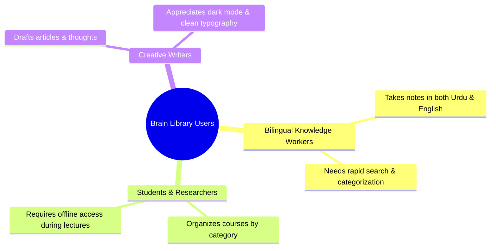

# Product Requirements Document (PRD) — Brain Library

## 1. Executive Summary

**Brain Library** is a modern, bilingual (English & Urdu), offline-capable note-taking and personal knowledge management web application. Designed to feel like a high-end "brain library," it allows users to organize their thoughts into distinct sections/categories, author rich text notes, instantly search across all content, and access their entire library whether online or offline.

### Key Value Propositions
- **True Offline First & Real-time Sync**: Built on Firebase Cloud Firestore with local IndexedDB persistence, ensuring uninterrupted note creation and editing even without an internet connection.
- **Native Bilingual & Full RTL Support**: Seamlessly switch between English (LTR) and Urdu (RTL), flipping both interface layouts and note typography.
- **Lightning-Fast Full-Text Search**: Client-side indexing powered by `Fuse.js` enables instant search across note titles, body text, tags, categories, and dates without relying on external search servers.
- **Rich Organization**: Intuitive categorization using custom color labels, emojis, tags, and pinning.

---

## 2. Problem Statement

Bilingual students and professionals who work across English and Urdu currently lack a cohesive, visually polished note-taking tool that treats Urdu right-to-left (RTL) typography as a first-class citizen rather than an afterthought. Furthermore, cloud-only note applications fail in environments with intermittent internet connectivity. Users need a reliable, fast, structured "second brain" that syncs seamlessly when online and functions completely offline.

---

## 3. Target Users & Personas

### Persona 1: Hamza (University Researcher)
- **Background**: Master's student studying literature and computer science.
- **Needs**: Organizes notes by subject/section; switches between English technical notes and Urdu research extracts; works on laptops in libraries with spotty Wi-Fi.
- **Pain Points**: Mainstream note apps break Urdu formatting or require internet access to search across large note libraries.

### Persona 2: Ayesha (Product Manager & Creator)
- **Background**: Bilingual professional managing personal projects and meeting notes.
- **Needs**: Fast categorization with visual cues (colors + emojis), instant search across dates and keywords, clean aesthetic with dark mode.

---

## 4. Product Goals & Success Metrics

| Goal Category | Key Performance Indicator (KPI) | Target Metric |
| :--- | :--- | :--- |
| **Performance** | Time to Interactive (TTI) on initial load | `< 1.5 seconds` |
| **Search Speed** | Client-side search latency across 1,000 notes | `< 50 milliseconds` |
| **Reliability** | Successful offline CRUD operations synced upon reconnection | `99.9% success rate` |
| **Usability** | Language/Theme toggle transition time | Instant (`< 16ms` frame render) |

---

## 5. Feature Requirements & Prioritization

### P0 (Must-Have for V1 Launch)
1. **Authentication**:
   - Email/Password sign-up and sign-in.
   - Instant Demo Mode for one-click instant exploration.
   - Session persistence and protected application routes.
2. **Category Management (Sections)**:
   - Create, edit, and delete categories.
   - Visual customization: Custom hex color badge + Emoji icon picker.
   - Filter main note list by selected category.
3. **Rich Text Note Authoring**:
   - Tiptap-powered editor supporting Bold, Italic, Headings (H1-H3), Bullet & Numbered Lists, Hyperlinks.
   - Note metadata: Title, Category assignment, custom color label, tags array, creation/modification timestamps.
   - Pinning/Unpinning notes to the top of lists.
4. **Offline & Real-Time Data Sync**:
   - Cloud Firestore multi-tab offline persistence.
   - Automatic background syncing when network connectivity is restored.
5. **Full-Text Client-Side Search**:
   - Search across note titles, rich text content, tags, category names, and formatted dates.
   - Works 100% offline via client-side `Fuse.js` index.
6. **Bilingual UI & RTL Flip**:
   - Dynamic English/Urdu language toggle.
   - Automatic DOM layout inversion (`dir="rtl"` / `dir="ltr"`) and Urdu font rendering (`Noto Nastaliq Urdu`).
7. **Soft Delete Trash System**:
   - Deleted notes move to Trash folder.
   - Ability to restore or permanently delete notes.
   - Background check on load to auto-purge notes older than 30 days.

### P1 (Nice-to-Have Post-V1)
- Keyboard shortcuts modal (`Ctrl+K` search bar, `Ctrl+N` new note).
- Category note counts badge in sidebar.
- Illustrated empty states for uncategorized or empty search results.

### P2 (Future Roadmap)
- Image and file attachments inside Tiptap editor.
- Export notes to PDF and Markdown format.
- Shared read-only links for public note sharing.

---

## 6. User Stories & Acceptance Criteria

| ID | Feature | User Story | Acceptance Criteria |
| :--- | :--- | :--- | :--- |
| **US-01** | Auth | As a new user, I want to sign up with Email/Password so I can create my private brain library. | **Given** unauthenticated user on `/signup` **When** valid email and matching passwords are submitted **Then** create Firebase Auth user, initialize user profile doc in Firestore, and redirect to `/dashboard`. |
| **US-02** | Auth | As a user, I want to explore the app instantly in Demo Mode without registering. | **Given** unauthenticated user on `/login` **When** clicking "Continue as Demo" **Then** initialize demo session (`demo_user_001`) and redirect to `/`. |
| **US-03** | Categories | As a user, I want to create a new category with a name, color, and emoji. | **Given** user on dashboard **When** clicking "+ Category" and saving `Name: "Work"`, `Color: "#10B981"`, `Emoji: "💼"` **Then** persist category to Firestore and display in sidebar immediately. |
| **US-04** | Categories | As a user, I want to filter my notes by clicking a category in the sidebar. | **Given** sidebar with multiple categories **When** clicking on "Work" **Then** update active filter state and display only notes where `categoryId == workCatId`. |
| **US-05** | Notes | As a user, I want to create a rich text note under a specific category. | **Given** active category selected **When** typing title and formatting text with headings/bold/lists **Then** auto-save note doc to Firestore with structured Tiptap JSON and plain text preview. |
| **US-06** | Notes | As a user, I want to pin important notes so they appear at the top of my list. | **Given** note card in list **When** clicking the Pin icon **Then** update `isPinned: true` and re-render note at the top of the feed. |
| **US-07** | Notes | As a user, I want to attach custom color labels and tags to my notes. | **Given** open note editor **When** selecting amber color label and typing tags `["urgent", "review"]` **Then** save metadata and display color border/tag chips on note card. |
| **US-08** | Search | As a user, I want to search for keywords across all my notes instantly. | **Given** user types "project deadline" in search bar **When** input debounces (300ms) **Then** `Fuse.js` filters notes matching keyword in title, body, or tags with highlighted matches. |
| **US-09** | Search | As a user, I want search to work offline without internet connectivity. | **Given** device is disconnected from Wi-Fi **When** typing search query **Then** client-side search returns exact and fuzzy matches from local cache. |
| **US-10** | i18n | As a bilingual user, I want to switch the app language to Urdu. | **Given** language selector in header **When** selecting "Urdu (اردو)" **Then** flip HTML attribute to `dir="rtl"`, apply Urdu Nastaliq font, and translate UI strings. |
| **US-11** | Theme | As a user, I want to toggle between Dark and Light mode. | **Given** theme toggle icon **When** clicked **Then** switch CSS color tokens smoothly and persist preference in `localStorage` + Firestore. |
| **US-12** | Offline | As a user, I want to create and edit notes while offline on an airplane. | **Given** no internet connection **When** creating a new note and editing existing notes **Then** save mutations to Firestore local IndexedDB cache and show "Offline - Changes Saved Locally" indicator. |
| **US-13** | Offline | As a user, I want my offline edits to sync automatically when internet restores. | **Given** locally queued offline mutations **When** network connectivity returns **Then** Firestore SDK automatically pushes mutations to cloud without data loss. |
| **US-14** | Trash | As a user, I want deleted notes to move to Trash so I can recover accidental deletions. | **Given** user clicks "Delete Note" **When** confirming **Then** set `isTrashed: true`, `trashedAt: now()`, remove from main list, and show 5s Undo toast. |
| **US-15** | Trash | As a user, I want notes in Trash older than 30 days to be automatically purged. | **Given** user opens app **When** background cleanup hook runs **Then** query and permanently delete any trashed notes where `trashedAt < now() - 30 days`. |

---

## 7. Non-Functional Requirements (NFRs)

1. **Performance**: Initial bundle size optimized via Next.js App Router code splitting.
2. **Security**: Strict Firestore Security Rules (`auth.uid == userId`).
3. **Accessibility**: Full keyboard navigation across sidebar, note list, and editor; WCAG 2.1 AA contrast ratio.
