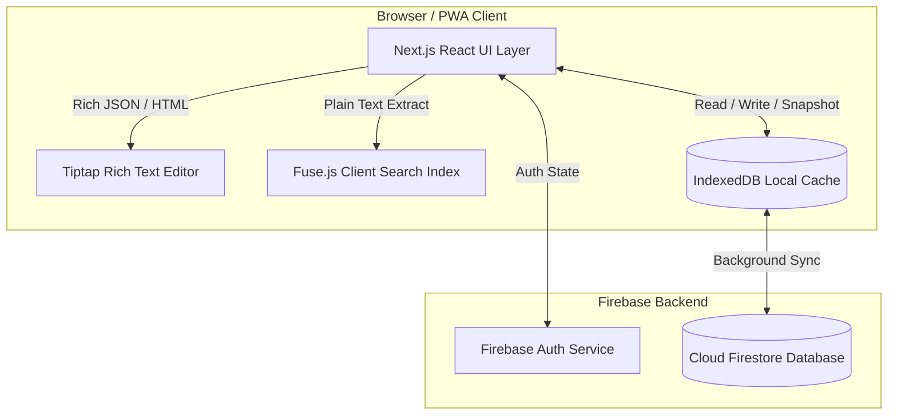
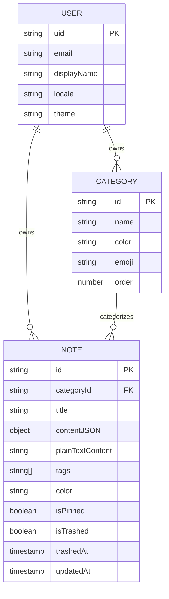

# Technical Requirements Document (TRD) — Brain Library

## 1. System Overview & Architecture

Brain Library is built on a modern **Next.js 15 App Router** architecture using **React 19 Client & Server Components**, styled with **Tailwind CSS v4**, and backed by **Firebase Cloud Firestore & Authentication**.



---

## 2. Technical Stack Specifications

| Layer | Technology | Justification |
| :--- | :--- | :--- |
| **Framework** | Next.js 15 (App Router) + TypeScript | Modern routing, clean folder structure, strict type safety. |
| **Styling** | Tailwind CSS v4 | Rapid responsive styling with native `rtl:` CSS variant support. |
| **Database & Offline** | Firebase Cloud Firestore | Multi-tab IndexedDB persistence out-of-the-box. |
| **Authentication** | Firebase Authentication | Secure Email/Password + Google OAuth JWT identity providers. |
| **Editor Engine** | Tiptap (ProseMirror core) | Headless rich text editor with flawless RTL/Urdu text support. |
| **Search Engine** | Fuse.js (v7.x) | Zero-latency client-side fuzzy search across memory index. |

---

## 3. Project Directory & Architecture

```text
src/
├── app/
│   ├── (auth)/
│   │   ├── login/page.tsx
│   │   └── signup/page.tsx
│   ├── (dashboard)/
│   │   ├── layout.tsx              # Protected App Shell (Sidebar + Header)
│   │   ├── page.tsx                # Main Notes Feed & Dashboard view
│   │   └── trash/page.tsx          # Trash recovery view
│   ├── layout.tsx                  # Root Layout (Fonts, Providers)
│   └── globals.css                 # Tailwind v4 directives + Urdu font rules
├── components/
│   ├── layout/
│   │   ├── Header.tsx              # Search bar, Theme & Language toggles
│   │   └── Sidebar.tsx             # Categories list & Navigation links
│   ├── notes/
│   │   ├── NoteCard.tsx            # Individual note item in grid/list
│   │   ├── NoteEditorModal.tsx     # Full-screen or modal Tiptap editor
│   │   └── TiptapToolbar.tsx       # Formatting controls
│   └── categories/
│       └── CategoryModal.tsx       # Color & Emoji picker modal
├── lib/
│   ├── firebase.ts                 # Firebase app initialization & SDK export
│   ├── firestore.ts                # Typed CRUD functions for Categories & Notes
│   ├── search.ts                   # Fuse.js singleton & index synchronizer
│   └── i18n/
│       ├── dictionaries.ts         # EN and UR string maps
│       └── LocaleContext.tsx       # Language & RTL direction provider
├── hooks/
│   ├── useAuth.ts                  # Listen to Firebase Auth user state
│   ├── useNotes.ts                 # Real-time Firestore snapshot listener
│   └── useSearch.ts                # Client-side debounced search hook
└── types/
    ├── note.ts                     # Note interface definitions
    └── category.ts                 # Category interface definitions
```

---

## 4. Firestore Data Schema & Indexes

We use a **Flat Data Schema** under each user document to allow fast, non-nested queries and optimal caching.



### TypeScript Type Definitions (`src/types/note.ts` & `src/types/category.ts`)

```typescript
export interface Category {
  id: string;
  name: string;
  color: string;       // Hex e.g. '#3B82F6'
  emoji: string;       // Unicode emoji e.g. '📚'
  order: number;
  createdAt: number;
  updatedAt: number;
}

export interface Note {
  id: string;
  categoryId: string | null;
  title: string;
  contentJSON: Record<string, any>; // Tiptap JSON document tree
  plainTextContent: string;         // Extracted string for Fuse.js indexing
  tags: string[];
  color: string;                    // Card accent color
  isPinned: boolean;
  isTrashed: boolean;
  trashedAt: number | null;
  createdAt: number;
  updatedAt: number;
}
```

---

## 5. Firestore Security Rules

Strict user isolation ensures zero cross-tenant data access:

```javascript
rules_version = '2';
service cloud.firestore {
  match /databases/{database}/documents {
    function isOwner(userId) {
      return request.auth != null && request.auth.uid == userId;
    }

    match /users/{userId} {
      allow read, write: if isOwner(userId);

      match /categories/{categoryId} {
        allow read, write: if isOwner(userId);
      }

      match /notes/{noteId} {
        allow read, write: if isOwner(userId);
      }
    }
  }
}
```
