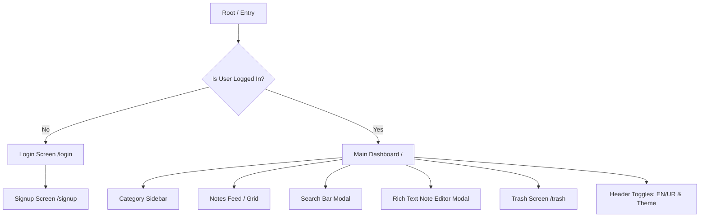
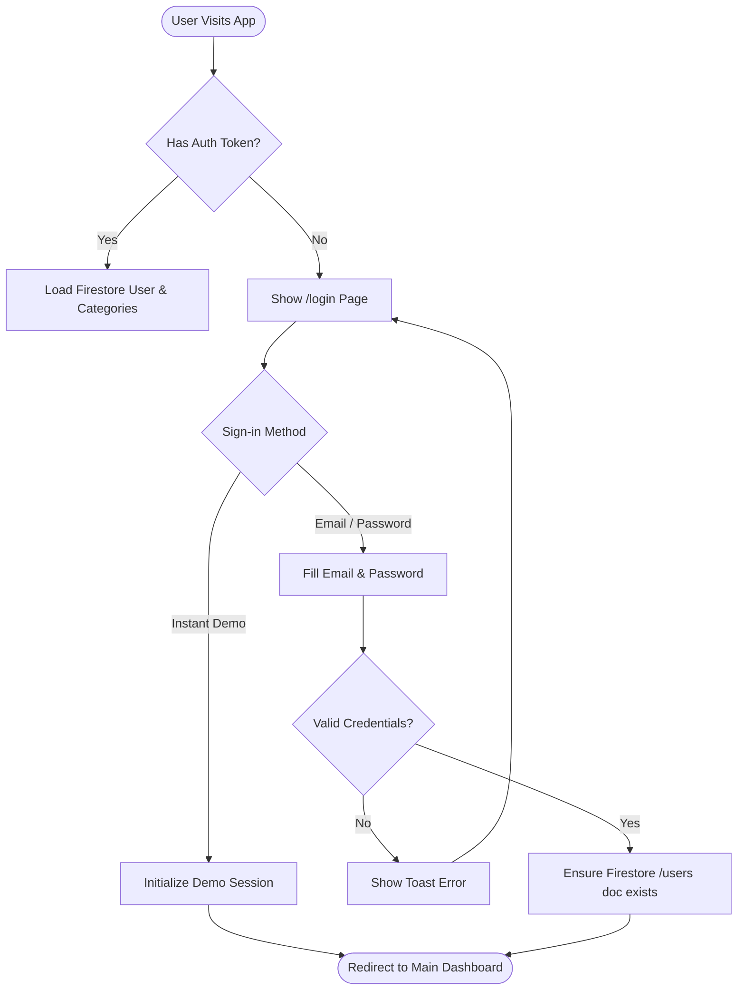
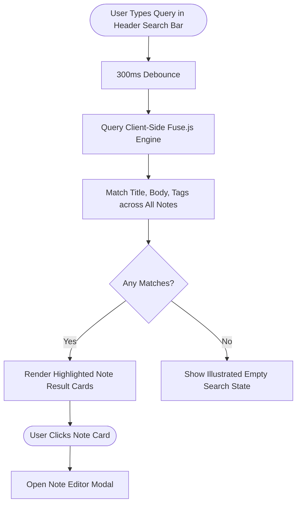
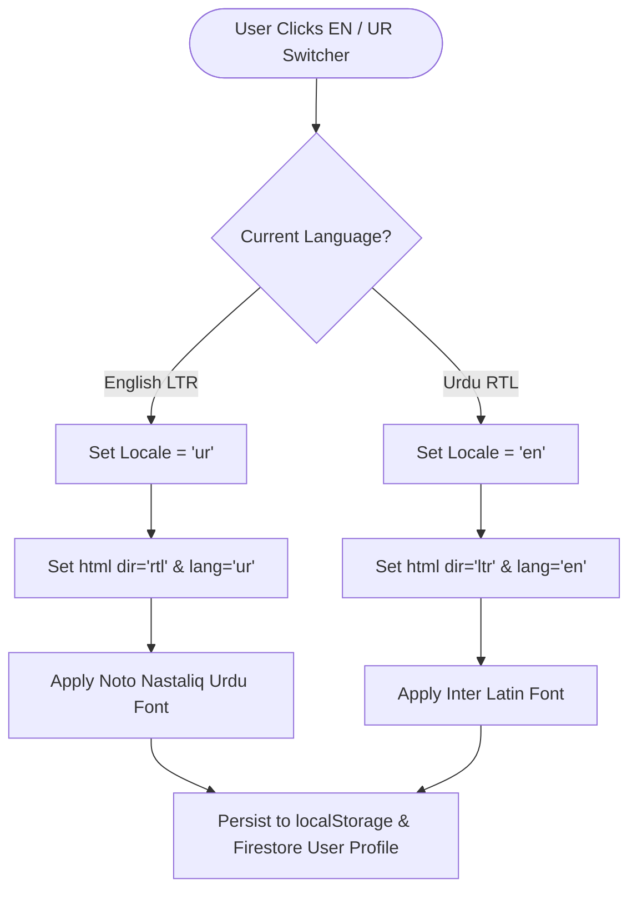

# User Flows & Screen Map — Brain Library

## 1. Complete Application Screen Map



---

## 2. Authentication Flow (Login & Signup)



---

## 3. Note Creation & Rich Text Auto-Save Flow

```mermaid
flowchart TD
  CLICK_NEW([User Clicks '+ Note']) --> INIT[Create local Note state]
  INIT --> OPEN_MODAL[Open Tiptap Editor Modal]
  
  OPEN_MODAL --> EDIT_LOOP[User Types Title & Rich Text]
  EDIT_LOOP --> DEBOUNCE[2000ms Debounce Timer]
  
  DEBOUNCE --> CHECK_NET{Is Online?}
  CHECK_NET -->|Yes| SAVE_CLOUD[Write Note to Firestore Cloud]
  CHECK_NET -->|No| SAVE_IDB[Write Note to Local IndexedDB]
  
  SAVE_CLOUD --> UPDATE_UI[Show 'Saved' Indicator]
  SAVE_IDB --> UPDATE_UI_OFF[Show 'Saved Locally (Offline)' Indicator]
  
  UPDATE_UI --> END([Continue Editing or Close Modal])
  UPDATE_UI_OFF --> END
```

---

## 4. Full-Text Search & Offline Filtering Flow



---

## 5. Bilingual Language & RTL Toggle Flow


