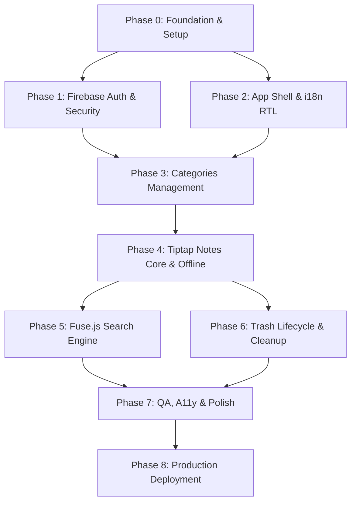

# Project Implementation Plan — Brain Library

## Phase Dependency Graph

---

## Phased Execution Plan & Checklist

### Phase 0: Project Setup & Core Foundation (Est: 4 Hours)
- [ ] Initialize Next.js 15 App Router project with TypeScript strict mode.
- [ ] Configure Tailwind CSS v4 and Google Fonts (`Inter` + `Noto Nastaliq Urdu`).
- [ ] Initialize Firebase SDK (`firebase.ts`) and configure environment variables (`.env.local`).
- [ ] Set up project directory structure (`components/`, `hooks/`, `lib/`, `types/`).

### Phase 1: Authentication & User Profiles (Est: 6 Hours)
- [ ] Build `AuthContext` provider with Firebase Auth listener.
- [ ] Create `/login` and `/signup` responsive pages.
- [ ] Implement Email/Password registration and Instant Demo Mode session handling.
- [ ] Automatically initialize user profile document in Firestore upon signup.

### Phase 2: Shell Layout, i18n & Theme Toggles (Est: 6 Hours)
- [ ] Build responsive Sidebar navigation (collapsible drawer on mobile).
- [ ] Build top Header bar with Search trigger, Dark/Light theme toggle, and EN/UR language toggle.
- [ ] Implement bilingual `LocaleContext` with dynamic DOM `dir="rtl"` layout flipping.

### Phase 3: Category Management (Est: 6 Hours)
- [ ] Build Firestore CRUD layer for `categories` subcollection.
- [ ] Create Category modal supporting custom Hex Color and Unicode Emoji selection.
- [ ] Implement category selection filter in the sidebar with live note counters.

### Phase 4: Rich Text Note Authoring & Offline Cache (Est: 10 Hours)
- [ ] Integrate Headless `Tiptap` editor with custom toolbar (Bold, Italic, Headings, Lists, Links).
- [ ] Configure automatic RTL direction handling inside Tiptap for Urdu text.
- [ ] Enable Firebase Cloud Firestore multi-tab IndexedDB offline persistence.
- [ ] Implement 2-second debounced auto-saving with online/offline status badge.

### Phase 5: Client-Side Full-Text Search (Est: 6 Hours)
- [ ] Build client-side `Fuse.js` singleton synchronized via `useNotes` real-time listener.
- [ ] Implement debounced search modal across titles, content body, tags, and category names.
- [ ] Verify search accuracy across both English keywords and Urdu Nastaliq script.

### Phase 6: Soft Delete Trash System (Est: 4 Hours)
- [ ] Implement soft deletion (`isTrashed: true`, `trashedAt: now()`) with 5-second Undo toast.
- [ ] Build dedicated `/trash` page with Restore and Permanent Delete actions.
- [ ] Implement background startup check to auto-purge notes older than 30 days.

### Phase 7: UI Polish, Micro-animations & QA (Est: 6 Hours)
- [ ] Add loading skeleton screens and glassmorphism styling touches.
- [ ] Test full offline CRUD workflow (airplane mode simulation).
- [ ] Verify accessibility keyboard navigation and WCAG AA contrast ratios.

### Phase 8: Production Deployment (Est: 2 Hours)
- [ ] Deploy production build and Firestore Security Rules to Vercel/Firebase Hosting.
- [ ] Execute final cross-browser and mobile responsiveness checks.

---

## Milestone Summary Table

| Phase | Deliverable Milestone | Est. Hours | Cumulative Hours |
| :--- | :--- | :---: | :---: |
| **Phase 0** | Scaffold & Firebase Foundation | 4h | 4h |
| **Phase 1** | Working Auth & Route Guards | 6h | 10h |
| **Phase 2** | App Shell, RTL Flip & Theme | 6h | 16h |
| **Phase 3** | Category CRUD & Color/Emoji Pickers | 6h | 22h |
| **Phase 4** | Tiptap Editor & Offline Sync | 10h | 32h |
| **Phase 5** | Instant Client-Side Search | 6h | 38h |
| **Phase 6** | Trash Management & Purge | 4h | 42h |
| **Phase 7** | QA & Polish | 6h | 48h |
| **Phase 8** | Production Launch | 2h | **50h Total** |
