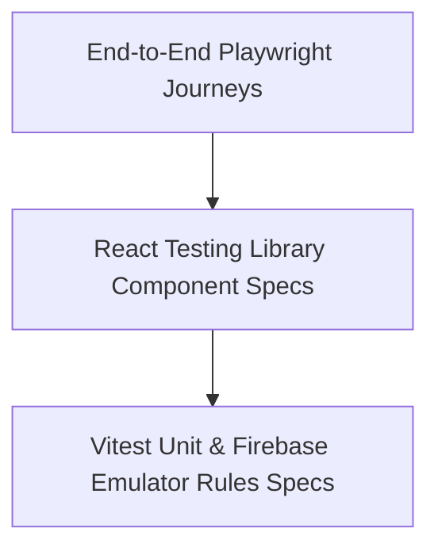

# QA & Testing Plan — Brain Library

## 1. Testing Strategy Overview

We follow a structured testing pyramid ensuring confidence across unit utilities, component renders, database security rules, and end-to-end user flows.



---

## 2. Test Cases & Acceptance Matrix

| ID | Test Type | Target Module | Test Scenario & Verification Criteria | Priority |
| :--- | :--- | :--- | :--- | :---: |
| **TC-01** | Unit | `lib/auth.ts` | Verify `signUpWithEmail` validates password strength and creates Firestore `/users` profile doc. | P0 |
| **TC-02** | Unit | `lib/search.ts` | Verify `Fuse.js` indexes English and Urdu Nastaliq strings and matches fuzzy typos within threshold `0.3`. | P0 |
| **TC-03** | Unit | `lib/firestore.ts` | Verify soft delete sets `isTrashed: true` and `trashedAt` timestamp without removing document. | P0 |
| **TC-04** | Unit | `lib/firestore.ts` | Verify auto-purge query correctly removes trash items older than 30 days. | P1 |
| **TC-05** | Component | `Sidebar.tsx` | Verify category selection updates active state and triggers note list filtering. | P0 |
| **TC-06** | Component | `Header.tsx` | Verify clicking EN/UR language toggle changes `document.documentElement.dir` to `'rtl'`. | P0 |
| **TC-07** | Component | `NoteCard.tsx` | Verify clicking pin icon calls `updateNote({ isPinned: !isPinned })`. | P0 |
| **TC-08** | Integration | Offline Sync | Verify mutations queued in IndexedDB while offline successfully sync to Cloud Firestore on reconnect. | P0 |
| **TC-09** | Security | Firestore Rules | Verify user A cannot read, write, or delete documents belonging to user B (`auth.uid` guard). | P0 |
| **TC-10** | E2E | Full User Journey | Simulate: Sign up → Create Category → Write Urdu note → Search note → Delete & Restore from Trash. | P0 |

---

## 3. Playwright End-to-End (E2E) Test Scenario

```typescript
// tests/e2e/note-lifecycle.spec.ts
import { test, expect } from '@playwright/test';

test('User can create bilingual note, search it, and trash it', async ({ page }) => {
  await page.goto('/login');
  // Sign in as test user
  await page.fill('input[type="email"]', 'test@brainlibrary.app');
  await page.fill('input[type="password"]', 'Secret123!');
  await page.click('button[type="submit"]');

  await expect(page).toHaveURL('/');

  // Toggle Urdu RTL
  await page.click('button[aria-label="Toggle language"]');
  await expect(page.locator('html')).toHaveAttribute('dir', 'rtl');

  // Create Note
  await page.click('button:has-text("نیا نوٹ")'); // New Note in Urdu
  await page.fill('input[placeholder="عنوان"]', 'اردو نوٹس'); // Urdu Notes
  await page.keyboard.type('یہ میرا پہلا نوٹ ہے');
  
  // Verify Saved Status
  await expect(page.locator('.save-badge')).toContainText('محفوظ'); // Saved
});
```
